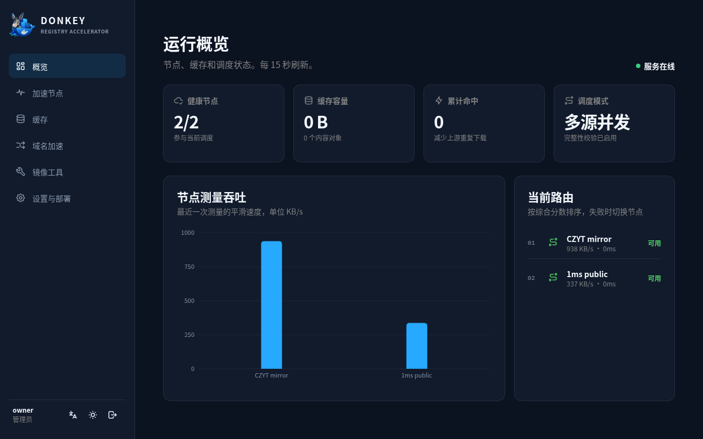
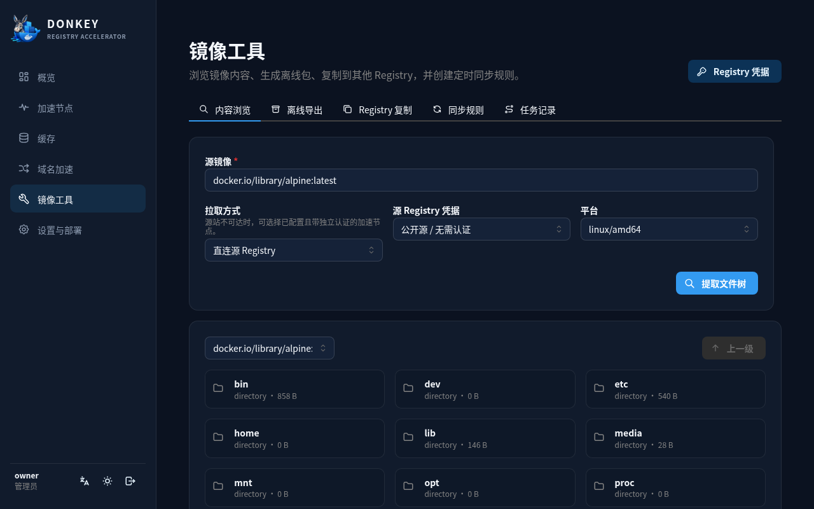
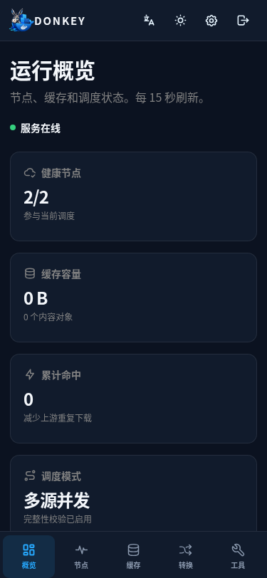
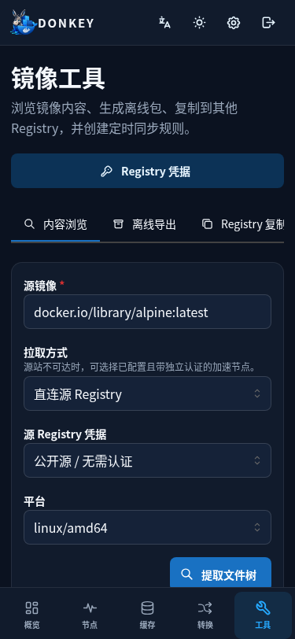

# Donkey for LazyCat

Donkey 的 LazyCat LPK v2 打包仓库。应用使用 `ghcr.io/ca-x/donkey:0.2.0`，包名为 `community.lazycat.app.donkey`。LPK `0.2.0` 通过以 root 用户运行容器，确保能够写入 LazyCat 持久目录。

## 入口

- `https://${LAZYCAT_APP_DOMAIN}/`：Docker Registry 与 DomainFold 入口
- `https://${LAZYCAT_APP_DOMAIN}/console/`：管理控制台
- `https://${LAZYCAT_APP_DOMAIN}/console/api/auth/oidc/callback`：OIDC 回调

管理端使用 LazyCat OIDC，空用户库中第一个成功登录的用户会成为管理员，不提供额外的初始化向导。管理界面与 API 都位于 `/console` 子路径，根路径完整保留给 Registry。

Docker 客户端可按常规 Registry 方式使用：

```bash
docker login <registry-domain>
docker pull <registry-domain>/library/nginx:latest
```

是否要求 `docker login` 取决于管理员在 Donkey 中配置的 Registry 认证策略。Registry 根路径必须允许 Docker CLI 到达 Donkey，因此 LazyCat 网关不承担这一入口的用户认证；管理接口仍由 Donkey 的 OIDC 会话和权限模型保护。

## 数据与凭据

- 持久数据：`/lzcapp/var/data` → `/data`
- Registry 凭据：使用每个应用实例稳定生成的 AES-256 主密钥加密后存入 SQLite
- OIDC client secret：由 LazyCat 在运行时注入，不写入仓库或 LPK

## 界面






<p>
  
  
  
</p>

## 本地构建

```bash
lzc-cli project release -o dist/community.lazycat.app.donkey.lpk
lzc-cli lpk info dist/community.lazycat.app.donkey.lpk
```

发布由 GitHub Actions 负责，同一份经过校验的版本化 LPK 会进入 GitHub Release、LazyCat 官方商店和配置的私有商店。
